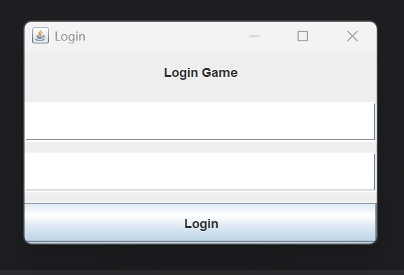
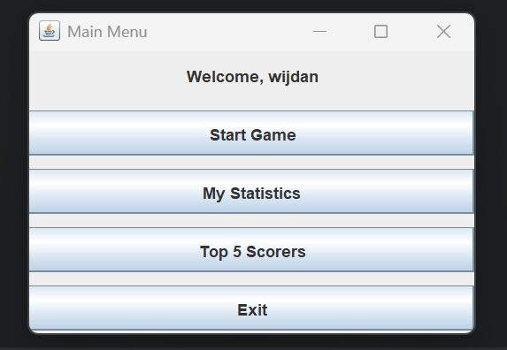
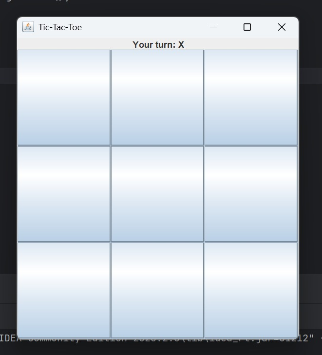
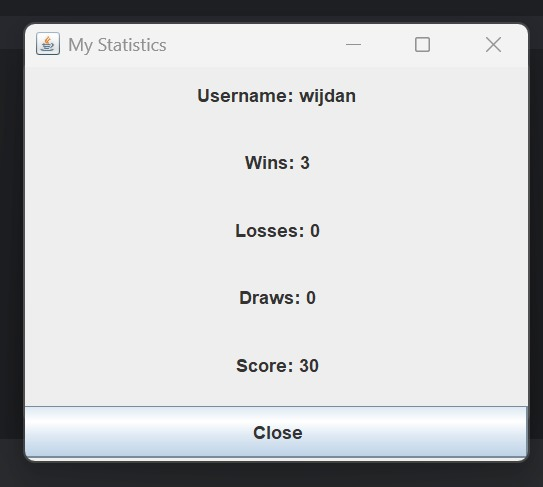
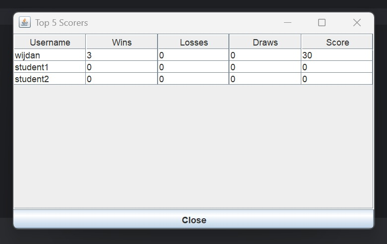

# Simple Tic-Tac-Toe Game with Java Swing, Login, and Statistics

## Student Information

**Name:** Adhika Trihanako Wijdan

**Student ID:** 5026251117

**Class:** Q/IUP

**Course:** ES234211 - Programming Fundamental

## Project Description

This project is a simple Tic-Tac-Toe game application built using Java Swing. The application provides a graphical user interface where users can log in, play Tic-Tac-Toe, view their personal statistics, and see the Top 5 scorers.

The application is connected to a MySQL database using JDBC. The database stores player login data and game statistics such as wins, losses, draws, and total score.

## Features

* Login using username and password from the database
* Play Tic-Tac-Toe using Java Swing GUI
* Detect win, lose, and draw results
* Prevent invalid moves on occupied cells
* Update player statistics after the game ends
* Display personal statistics
* Display Top 5 scorers using JTable
* Store all player data in one database table

## Game Rules

The game used in this project is Tic-Tac-Toe. The player uses the symbol **X**, while the computer uses the symbol **O**.

The player and computer take turns placing their symbols on a 3x3 board. A player wins if they place three symbols in the same row, column, or diagonal. If all cells are filled and there is no winner, the game ends in a draw.

## Score Calculation

The scoring system used in this project is:

| Result | Score |
| ------ | ----: |
| Win    |   +10 |
| Draw   |    +3 |
| Lose   |    +0 |

## Database

This project uses **MySQL** as the database management system.

Database name:

```sql
game_project
```

Table name:

```sql
players
```

The database only uses one table. The table stores both login information and game statistics.

### Table Structure

| Column   | Description      |
| -------- | ---------------- |
| id       | Player ID        |
| username | Player username  |
| password | Player password  |
| wins     | Number of wins   |
| losses   | Number of losses |
| draws    | Number of draws  |
| score    | Total score      |

### SQL Schema

The SQL file is located in:

```text
database/schema.sql
```

To create the database, run the SQL script in MySQL Workbench.

## How to Run the Program

1. Clone or download this repository.
2. Open the project using IntelliJ IDEA.
3. Create the database using the SQL file in `database/schema.sql`.
4. Add MySQL Connector/J to the project library.
5. Open `DatabaseManager.java`.
6. Make sure the database URL, username, and password match your MySQL configuration.
7. Run `Main.java`.
8. Login using one of the accounts from the database.
9. Start the game from the main menu.

## Example Login Account

```text
Username: wijdan
Password: 12345
```

or

```text
Username: student1
Password: 12345
```

## Class Explanation

### Main.java

This class is used to start the program. It opens the Login Window using Java Swing.

### DatabaseManager.java

This class handles the database connection using JDBC. It stores the database URL, username, and password.

### Player.java

This class is a model class that stores player data such as ID, username, wins, losses, draws, and score.

### PlayerService.java

This class handles database operations, such as checking login data, updating player statistics, retrieving player data, and retrieving the Top 5 scorers.

### GameLogic.java

This class handles the Tic-Tac-Toe game logic. It checks valid moves, detects winners, checks draw conditions, and generates computer moves.

### LoginFrame.java

This class displays the login window. It allows the user to enter username and password, then checks the login data from the database.

### MainMenuFrame.java

This class displays the main menu after successful login. The user can start the game, view personal statistics, view Top 5 scorers, or exit the application.

### GameFrame.java

This class displays the Tic-Tac-Toe game board using Java Swing buttons. It connects the GUI buttons with the game logic and updates the database after the game ends.

### StatisticsFrame.java

This class displays the personal statistics of the logged-in player, including wins, losses, draws, and score.

### TopScorersFrame.java

This class displays the Top 5 scorers from the database using JTable.

## Project Structure

```text
SwingGameProject/
├── src/
│   ├── Main.java
│   ├── DatabaseManager.java
│   ├── Player.java
│   ├── PlayerService.java
│   ├── GameLogic.java
│   ├── LoginFrame.java
│   ├── MainMenuFrame.java
│   ├── GameFrame.java
│   ├── StatisticsFrame.java
│   └── TopScorersFrame.java
│
├── database/
│   └── schema.sql
│
├── screenshots/
│   ├── login-window.png
│   ├── main-menu-window.png
│   ├── game-window.png
│   ├── statistics-window.png
│   └── top-scorers-window.png
│
└── README.md
```

## Screenshots

### Login Window


### Main Menu Window


### Game Window


### My Statistics Window


### Top 5 Scorers Window


## Completed Parts

The completed parts in this project include:

* Database connection configuration
* Login checking using database
* Login button event handling
* Main menu navigation
* Tic-Tac-Toe game logic
* Game button event handling
* Win, lose, and draw detection
* Statistics update after game ends
* Personal statistics display
* Top 5 scorers display using JTable

## YouTube Demonstration Video

https://youtu.be/St0ep0RKsZE


## Conclusion

This project demonstrates the use of Java Swing, simple Object-Oriented Programming, JDBC database connection, game logic, and database-based statistics in a small but complete game application. The application allows users to log in, play Tic-Tac-Toe, update statistics, and view the Top 5 scorers.
